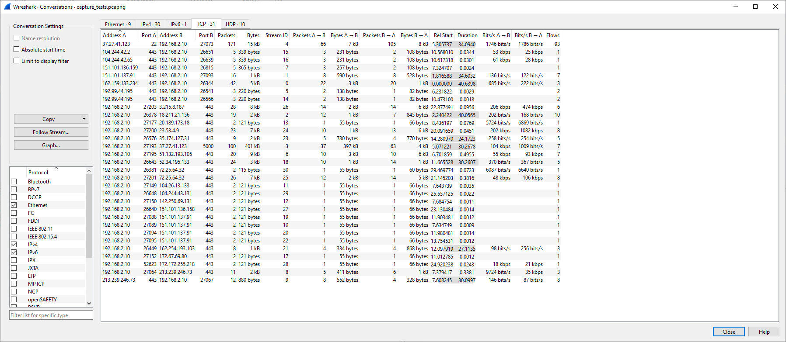
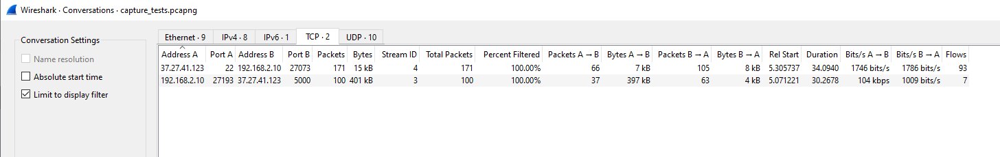
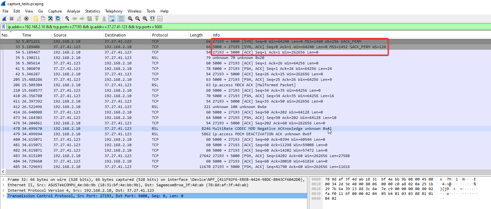
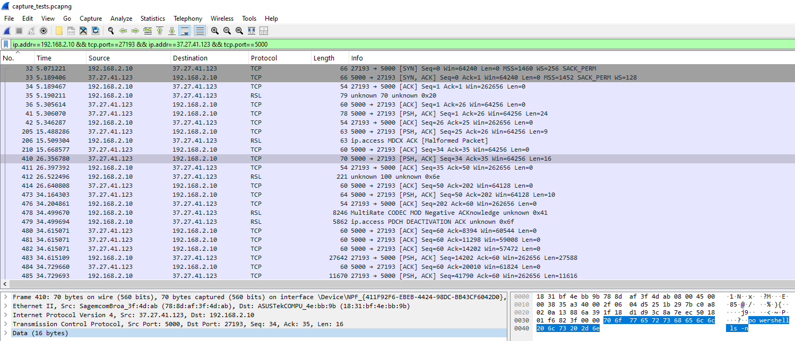
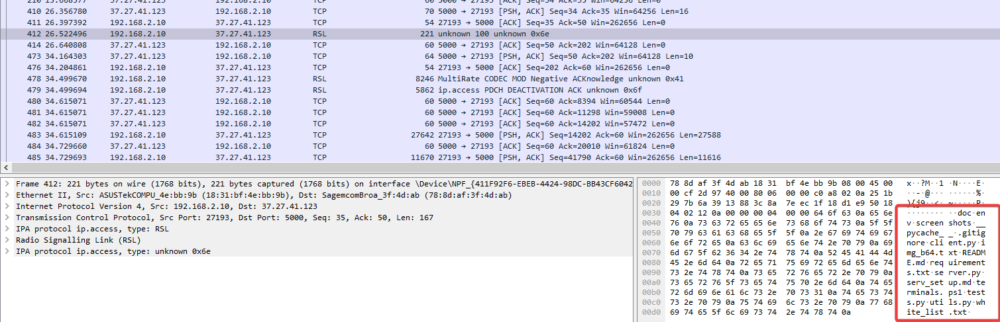

# Wireshark Investigation
Investigation Goal: Find network traffic resembling a reverse shell.

The first approach to find the network trace is to get a global view, a **group-by**  
of the traffic to spot anomalies and detect unusual cases.  
We assume the communication happens over TCP.

Wireshark’s main page doesn’t have a group-by view, but we can go to the Conversations tab  
to get an overview with src/dst/port combinations:  
> Statistics -> Conversations -> TCP (tab)  

We notice a lot of traffic on port 443 (https), which isn’t of interest here
since we assume the reverse shell doesn’t use https.  
So, we’ll exclude it to see what’s left.

Filter:  
> !(tcp.port==443)

Return in the conversation view. 

We’re left with only 2 streams leading to an external IP.  
The first stream on port 22 (SSH), used to communicate with the server in this demo.  
The second one is on port 5000 (arbitrary), which is more interesting.

We apply it as a filter:  
> Right-click -> Apply as filter -> Selected -> A <-> B  

We can immediately see the three-way handshake between the server and our client (localhost)  

Inspecting the frames, we find the commands sent between the client and server:  
  

